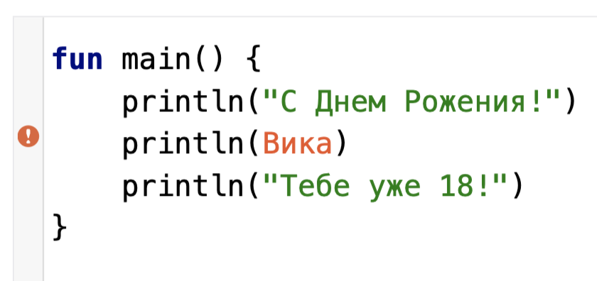

# Что делают программисты?

Если опустить множество деталей, то пишут программы. Да, вот так вот просто. На самом деле, на примере этого выражения можно сформулировать
одну из главных основ программирования: чем проще, тем лучше.

Программа — это серия инструкций (или указаний) машине, что нужно сделать. Допустим, у вас очень много родственников и вам постоянно
приходится им всем посылать поздравления. Эту задачу можно автоматизировать — написать программу, в которой мы зададим базовый текст
поздравления. На вход программе будем давать имя именинника, на выходе же программа выдаст нам готовое поздравление с нужным именем.

Так же, как мы говорим, например, на русском, чтобы общаться с людьми, существуют различные язык программирования, чтобы общаться с машиной.
К большому счастью, языки программирования гораздо проще и логичнее человеческих языков!

# Почему Kotlin?

На Котлине можно писать мобильные, серверные и десктопные приложения. Котлин — язык общего назначения, его можно использовать в множестве
сфер:
финансы, телекоммуникация, медицина и т.д. Но нас в первую очередь интересует Android. В 2017 году Google объявила, что поддержка Котлин в
Android стала официальной
(до этого приложения писались на Java), а уже в 2019, что Котлин — предпочтительный язык для написания Android приложений. Поэтому, мы сразу
начнем с Котлина.


# Стартуем

Начнем знакомство с языком с написания первой программы. Для упрощения, пока нам понадобится только браузер.

1. Перейдите по [ссылке](https://developer.android.com/training/kotlinplayground)
2. Вы должны увидеть экран с редактором 

## Запуск программы

1. В редакторе, в правом верхнем углу, найдите значок зеленого треугольника  и кликните по нему для
   запуска.
2. Посмотрите на панель внизу.
3. Результат выполнения программы — напечатанная строка `Hello, world!`

## Изменение программы

Давайте немного изменим нашу программу.

1. Поменяйте строку “Hello, world!” на “С Днем Рождения!”
2. Запустите программу нажатием на 
3. Посмотрите на панель внизу — результатом работы должна быть строка `С Днем Рождения!`

Поздравляю! Вы только что провели _рефакторинг_ (переработку) кода.

# Разбор на составляющие

Давайте разберем код по кусочкам:

```kotlin
fun
```

* `fun` - это “слово” на языке Котлин. `fun` — сокращение от слова функция (function). Функция — это контейнер для инструкций. Любая
  инструкция должна быть написана внутри функции. Пример инструкции: _напечатать на экран "Hello, world!"_

> В языке Котлин много “слов”. По ходу изучения языка мы будем с ними знакомиться. Обычно эти “слова” называются <i>ключевыми</i> (keywords) или <i>зарезервированными</i> (reserved words)

```kotlin
fun main
```

* `main` - имя функции. Каждая функция должна иметь имя. В Котлине точкой входа в программу является функция с названием `main`, поэтому в
  каждой программе Котлина должна быть функция с таким названием.

```kotlin
fun main()
```

* После имени функции должны идти круглые скобки `()`. В скобках задаются аргументы функции.  
  Например, для функции, которая бы печатала поздравления, аргументом бы являлось имя именинника. В данном случае у функции `main()`
  аргументов нет, а как они задаются мы рассмотрим чуть позже.

```kotlin
fun main() {
}
```

* После аргументов идут фигурные скобки `{}` - тело функции. Между этими двумя скобками пишутся инструкции.

```kotlin
println("С Днем Рождения!")
```

* Инструкция `println` говорит компьютеру напечатать строку, переданную внутри двойных кавычек `" "`. На самом
  деле `println("С Днем Рождения!")` является вызовом функции!
  Имя функции — `println`, а аргумент — строка `"С Днем Рождения!"`. Что находится внутри функции `println` мы смотреть не будем — нам на
  данном этапе важно понимать, что одна функция может вызывать другую.

На этом все. Мы разобрали по кускам самую маленькую функцию на Котлине

```kotlin
fun main() {
    println("С Днем Рождения!")
}
```

# Отлично, разрабатываем дальше

В нашей первой программе была всего одна инструкция. Давайте теперь напишем еще пару. Скопируйте строку `println("С Днем Рождения!")` и
вставьте еще 2 раза в следующие строки. Текст поменяйте на ```"Вика"``` и ```"Тебе уже 18!"```. Должно получится следующее:

```kotlin
fun main() {
    println("С Днем Рождения!")
    println("Вика")
    println("Тебе уже 18!")
}
```

Запустите программу и посмотрите, что получится на выходе. Программа должна напечатать следующее:

```
С Днем Рождения!
Вика
Тебе уже 18!
```

## Работа с ошибками

Языки программирования строятся по строго определенным правилам и не терпят вольностей. Если в программу закралась ошибка, то большинство
редакторов вам об этом скажут.

1. Уберите двойные кавычки `" "` вокруг текста `Вика`, чтобы получилось как показано ниже

```kotlin
println(Вика)
```

2. Запустите программу. Текст `Вика` должно подсветиться красным.
   
3. В панели вывода должен появиться текст ошибки `Unresolved reference: Вика`. Хоть вы пока и не знаете, что это точно значит, но уже могли
   догадаться, что пошло не так. Как мы говорили ранее, текст обязательно должен обрамляться кавычками.
4. Верните кавычки на место.
5. Запустите программу, чтобы убедиться, что все снова заработало.
6. Вы великолепны!

# Резюмируя

1. Можно практиковаться в написании программ на Котлине в веб-редакторе [тут](https://developer.android.com/training/kotlinplayground).
2. В каждой программе на Котлине должна быть функция `main()`.
3. Функция `println()` выводит текст на экран.
4. Текст в коде обязательно должен быть помещен между двойными кавычками `" "`.
5. При ошибках в коде, редактор подсветит этот кусок красным и напишет, что пошло не так.

# Practice makes perfect

> В конце каждого урока будут небольшие задачи. Они необязательны к выполнению, но помогут вам укрепить изученный материал

__Сделайте следующее:__

1. Поменяйте все `println()` на `print()`
2. Запустите программу. Что поменялось?

__Задача:__ используя для вывода текста только `print()` выведите текст так, чтобы каждая часть сообщения была на своей строке.

__Подсказка 1:__ символ `\n` добавляет перенос строки. Например, `С Днем \n Рождения`

__Подсказка 2:__ можно напечатать новую строку, если вызвать `println()` без текста

<details>
<summary><b>Решение</b></summary>

Один из вариантов решения выглядит так

```kotlin
fun main() {
    print("С Днем Рождения!\n")
    print("Вика\n")
    print("Тебе уже 18!")
}
```
</details>