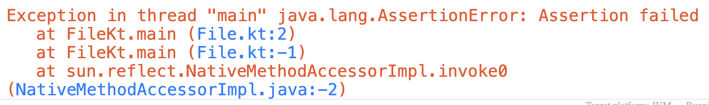

# Make val, not var

Давайте объявим переменную с начальным значением, а потом попытаемся это значение изменить.

```kotlin
fun main() {
    val a = 10

    a = 5
}
```

1. Запустите программу и посмотрите что будет.
2. Вы должны увидеть такую ошибку 

Это ошибка говорит нам, что значение `val` не может быть изменено. Но ведь переменная на то и "переменная", что может менять свое значение.
Неужели в программировании это не так? Признаюсь, говоря об объявлении переменных я рассказал вам только половину правды, но сейчас
собираюсь выложить все карты на стол!

Переменные могут быть объявлены с помощью 2 ключевых слов: `val` и `var`.

* `val` - переменная, объявленная с помощью этого ключевого слова, не может изменить значение после первого присвоения.
* `var` - такую переменную можно сколько угодно раз менять

Рассмотрим это различие на примере:

```kotlin
fun main() {
    var b = 10

    println("Initial value is ${b}")

    b = 15

    println("Final value is ${b}")
}
```

1. Перепишите этот код в редактор и нажмите запуск
2. Вывод должен быть следующим:

```
Initial value is 10
Final value is 15
```

Как мы можем видеть, код без проблем запустился. Работа с `var` синтаксически ничем не отличается от `var', их единственное различие - `
`var` можно менять после первого присваивания, `val` - нет. Обратите внимание на `можно менять после первого присваивания` - изначально мы
можем объявить переменную без значения и присвоить его чуть позже. Например,

```kotlin
fun main() {
    val a: Int

    println("A has no value yet")

    a = 10

    println("Final value is ${a}")
}
```

Если мы не присваиваем значение сразу, то мы должны явно указать тип переменной. Также, если мы попытаемся обратиться к переменной без
значения, то получим ошибку

```kotlin
fun main() {
    val a: Int

    println("Initial value is ${a}")

    a = 10

    println("Final value is ${a}")
}
```

1. Перепишите этот код в редактор и запустите
2. Обратите внимание на ошибку в консоли вывода 

> Переменная, которая объявлена (`val a: Int`), но которой еще не присвоено значения, называется _не инициализированной_

# Операторы сравнения

В Котлине есть стандартные математические операторы сравнения `>` больше, `<` меньше, `>=` больше или равно, `<=` меньше или равно. Чтобы
сравнить 2 переменные на равенство, используется оператор `==`. Для сравнения на неравенство - `!=`. Восклицательный знак `!` почти всегда
дает отрицание выражения, в котором стоит.

Сейчас самое время познакомиться с еще одним типом данных в Котлине: `Boolean` - тип, который принимает только одно из двух значений, `true`
или `false`.

```kotlin
fun main() {
    val amIHungry = true

    var a: Boolean = false

    val first = 10
    val second = 20

    a = first > second
}
```

* Переменной типа `Boolean` можно сразу присвоить значение `true` или `false`
* Значением `Boolean` переменной также может являться результат логического выражения, например `a = first > second`

# Если (), то {}, иначе {}

Допустим перед нами стоит задача: если число больше или равно 100, вывести на экран `"Big enough"`, иначе вывести на экран "Small". Здесь
нам нужно каким-то образом написать условие. Для этого в Котлине существует следующая конструкция:

```kotlin
fun main() {
    val a = 200

    if (a >= 100) {
        println("Big enough")
    } else {
        println("Small")
    }
}
```

* `if` - ключевое слово `if` означает, что началась конструкция условия (или чаще говорят _ветвления_)
* `if  (a >= 100)` - далее в круглых скобках `()` следует условие, которе должно иметь тип Boolean. Это может быть как выражение,
  например, `if (a == b) {}` или заранее объявленная переменная типа `Boolean`, например, `if (amIHungry) {}`
* `if (a >= 100) { println("Big enough") }` - в фигурных скобках `{ }` пишется код, который будет выполнен в случае, если выражение в части
  условия (в круглых скобках) даст `true`.
* `else { println("Small") }` - если же выражение дало `false`, то будет выполнен код, написанный в теле блока `else`

Части `else` может и не быть. Например, для задачи "Выведите сообщение `"Caution!"`, если скорость превысила 60 км/ч", мы бы написали
следующее решение:

```kotlin
fun main() {
    val speed = 40

    if (speed > 60) {
        println("Caution")
    }
}
```

Давайте соберем все полученные знания воедино и решим задачу.

__Задача:__ напишите функцию `twoNums()`, которая на вход принимает 2 числа: __A__ и __B__. На выходе нужно напечатать значение
переменной __C__, которое:

1. Изначально равно 10
2. Если __A__ больше 100, то значение __C__ надо умножить на 2, иначе поделить на 2.
3. Далее, основываясь на текущем значении __C__:
    * если __C__ не равно __B__, то отнять от __C__ половину __B__
    * иначе оставить __C__ как есть

> Для некоторых задач будет дополнительный раздел __Тесты__. В этом разделе будет написано, какой код нужно скопировать в метод `main()`,
> чтобы после запуска кода проверить, правильно ли работает ваша функция. Например, если дан такой тест: `assert(twoNums(10, 20) == -5`, нужно:
> 1. Скопировать этот кусок кода в метод `main()` и запустить его.
> 2. Посмотреть, что вывелось на экран:
>   * если такая ошибка, то тест провален 
>   * если ничего — тест прошел
>
> Тесты лучше запускать по очереди: так вы легче сможете определить на каких входных данных ваша программа не работает.

__Тесты:__

1. `assert(twoNums(10, 20) == -5)`
2. `assert(twoNums(-10, 0) == 5)`
3. `assert(twoNums(1000, -1000) == 520)`

<details>
<summary><b>Решение</b></summary>

```kotlin
fun twoNums(a: Int, b: Int): Int {
    var c = 10

    if (a > 100) {
        c = c * 2
    } else {
        c = c / 2
    }

    if (c != b) {
        c = c - b / 2
    }

    return c
}
```

</details>

# Набираем классы

Последний концепт, который нам понадобится для быстрого старта в Андроиде — __классы__. Примеры классов: машина, школьное расписание, банан,
музыка. Класс — это объект реального мира, перенесенный в код. Но не с точностью до каждой мельчайшей детали, а только те качества объекта,
которые важны для решения задачи.

Например, возьмем машину. У машины очень много параметров: цвет, кол-во колес, макс скорость, производитель, вес и т.д. Допустим, мы пишем
программу, которая будет выдавать оценку стоимости машины. Какие свойства машины вы бы взяли для этой задачи?

Я бы взял

* максимальную скорость
* кол-во лошадиных сил
* подержанная или нет

Для простоты остановимся на этом. Как видите, эти атрибуты — очень маленькая часть от всей машины, но для решения поставленной задачи нам
нужны лишь они. Давайте теперь рассмотрим как объявить класс в Котлине:

```kotlin
class Car {

    fun makeSomeNoise() {
        println("Beep-beep!")
    }
}
```

* `class Car` - классы объявляются с помощью ключевого слова class после которого идет название класса.
* `{ }` - в фигурных скобках пишется тело класса. Класс может содержать функции и поля (о них мы поговорим чуть позже).

Для чего нужны классы? Почему бы не писать просто все методы в одной куче, как мы делали это раньше? В программировании очень важно
выстраивать структуру кода, т.к. в больших программах очень много кода и в нем становиться тяжело разобраться. Проще, когда есть знакомые
концепции из реального мира. Например, нам надо напечатать на экран, какой сегодня день. Скорее всего метод для печати будет находиться в
классе Календарь. В одном классе гораздо проще разобраться и ориентироваться, чем во всех функциях программы сразу, когда они в одной куче.

> Функции класса также называют _методами_ класса

## Классные объекты

Давайте подумаем, что такое машина? Является ли Лада Калина машиной? А Лэнд Крузер? А если я пределаю колеса к картонной коробке и скачусь в
этой шайтан-машине с горы, будет ли это машиной? Здесь нужно разделить _идею_ машины с конкретными ее реализациями.

* Идея — средство передвижения с колесами
* Конкретные реализации - bvw x5 2021 года выпуска с серийным номером 123456 и т.д.

Класс — идея, объект — конкретная реализация (экземпляр класса).

Можно сказать, что числа тоже пример классов и объектов:

* Сама концепция числа — идея (количество чего-либо).
* `1`, `2`, `3`, `-1000` - это все объекты класса Число, т.е. конкретные ее реализации.

В классе мы описываем шаблон, а потом по этому шаблону создаем объекты. Давайте опишем класс, а потом создадим объект этого класса.

```kotlin
fun main() {
    val car = Car()
}

class Car {
}
```

* Мы описали класс `Car`. Пока он пустой.
* В методе `main()` мы создаем _объект_ класса `Car`. Для этого мы пишем имя класса и круглые скобки.

## Методы класса

Класс может содержать методы. Обычно все эти методы логически связаны с этим классом. Например, у нас есть класс `Car`. Будет логично, если
у него будут методы `drive()` и `fuel()`, но не логично, если мы добавим ему метод `makeCookies`.

> __Naming conventions__
>
> Название классов начинается с большой буквы, методов - с маленькой.
> Также, название класса обычно является сущностью (существительным), методов — действием. Например, класс `MusicalInstrument`, а метод `playMusic()`.

Рассмотрим на примере:

```kotlin
fun main() {
    val car = Car()

    car.drive()
}

class Car {

    fun drive() {
        println("Wroom-wroom!")
    }
}
```

* внутри тела класса (между фигурными скобками `{ }`) мы объявляем метод как обычно. Методов может быть сколько угодно много.
* в методе `main()` мы создаем экземпляр класса и вызываем у него метод `drive()`. Для этого мы пишем имя переменной и через точку `.`
  название метода.

## Поля класса

Поля нужны, чтобы в них хранить состояние класса. Например, у машины могут быть поля `maxSpeed` и `brand`.

```kotlin
fun main() {
    val car1 = Car(100, "Лада")
    val car2 = Car(200, "Mercedes")

    println("Speed of car1 = ${car1.maxSpeed}")
    println("Brand of car2 = ${car2.brand}")
    println("Price of car2 = ${car2.price}")
}

class Car(val maxSpeed: Int, val brand: String) {

    var price = 100
}
```

* `class Car (val maxSpeed: Int, val brand: String)` - поля могут перечисляться в круглых скобках сразу после имени класса.
* `var price = 100` - а могут и в теле класса.
* `car1.maxSpeed` - обращение к полю класса также идет через точку `.`.

Если поле класса указано при его объявлении (в круглых скобках), то его значение должны передано "извне" при создании объекта. Поля, которое
указывается в теле класса, мы инициализируем сами.

> Обратите внимание, что при обращении к методам, мы пишем круглые скобки `()`, но при обращении к полям — нет.

## Конструктор, но не Lego

На самом деле, мы воспользовались короткой записью класса. Давайте перепишем на полную версию:

```kotlin
class Car constructor(val maxSpeed: Int, val brand: String) {
}
```

Аргументы класса, которые используются при его создании называются __конструктором__ класса. Именно его мы вызываем при создании
объекта `Car(100, "Лада")`. Ключевое слово `constructor` нужно явно указывать, когда к нему применяются различные модификаторы. Но на данном
этапе нам это не нужно и мы не будем его явно указывать.


---

__Задача:__ напишите класс `Fridge`, у которого при создании задается атрибут максимальной вместимости. У этого класса должно быть 2 метода:
положить продукт (`put`) и достать (`take`). Если продукт удалось положить в холодильник (есть место), то метод должен вернуть `true`, иначе - `false`. То же и для метода "достать продукт": если есть что доставать, то должно вернуться `true`, иначе - `false`.

__Тесты:__

1.

```kotlin
fun main() {
    val fridge = Fridge(3)

    var result = fridge.put()

    assert(result == true)

    fridge.put()
    fridge.put()

    result = fridge.put()

    assert(result == false)
}
```

2.

```kotlin
fun main() {
    val fridge = Fridge(2)

    var result = fridge.take()

    assert(result == false)

    fridge.put()

    result = fridge.take()

    assert(result == true)
}
```

<details>
<summary><b>Решение</b></summary>

```kotlin
class Fridge(val capacity: Int) {

    var currentAmount = 0

    fun put(): Boolean {
        if (currentAmount < capacity) {
            currentAmount++

            return true
        } else {
            return false
        }
    }

    fun take(): Boolean {
        if (currentAmount > 0) {
            currentAmount--

            return true
        } else {
            return false
        }
    }
}
```

> Операторы `currentAmount++` (_инкремент_) и `currentAmount--` (_декремент_) эквивалентны записи `currentAmount = currentAmount + 1` и `currentAmount = currentAmount - 1` соответственно.
</details>

## Наследие

Очень важным свойством классов является возможность наследования. Например, есть класс `A`, у которого есть метод `a()` и поле `f`. Если мы
создадим класс `B` и отнаследуемся от класса `A`, то у `B` сразу будут доступны метод `a()` и поле `f`.

Рассмотрим на примере^

```kotlin
fun main() {
    val child = Child("Катя")

    child.greet()

    println("Age = ${child.age}")
}

open class Parent(val name: String) {
    val age = 10

    fun greet() {
        println("Привет, я $name!")
    }
}

class Child(name: String) : Parent(name)
```

* `open class Parent()` - для того, чтобы от класса можно было наследоваться, он должен быть помечен ключевым слово `open`
* `class Child : Parent()` - для наследования мы через двоеточие пишем имя родительского класса.
* `class Child(name: String) : Parent(name)` - если у родителя есть не пустой конструктор (присутствуют аргументы), то в описании класса мы
  должны ему эти аргументы передать.
* у самого класса `Child` нет ни методов, ни полей, но у его объекта мы можем обратиться к родительским полям и методам.

> Если тело класса пустое, то фигурные кавычки `{ }` можно не писать

# Резюмируя

* `val`-переменные не могут изменять свое значение, `var` - могут.
* Операторы сравнения (`>`, `<`, `>=`, `<=`, `==`, `!=`) возвращают `Boolean` значение (`true` или `false`).
* Для ветвления используется конструкция `if (condition) { ... } else { ... }`.
* Классы объявляются с помощью ключевого слова `class`.
* Класс — шаблон, объект класса — конкретная реализация.
* Классы могут наследоваться: классы-потомки могут использовать методы и поля родителя. Класс-родитель должен быть помечен ключевым
  словом `open`.

# Practice makes perfect

__Задача:__ напишите 2 класса: `Square` и `Rectangle`. У обоих классов должен быть конструктор, который принимает длину и ширину, а также методы:

1. `getArea() : Int` - возвращает площадь фигуры
2. `getPermieter() : Int` - возвращает периметр фигуры

__Подсказка:__ чтобы не дублировать код, используйте наследование

__Тесты:__

```kotlin
fun main() {
    val square = Square(2)
    val sArea = square.getArea()
    val sPerimeter = square.getPerimeter()

    assert(sArea == 4)
    assert(sPerimeter == 8)

    val rectangle = Rectangle(2, 3)
    val rArea = rectangle.getArea()
    val rPerimeter = rectangle.getPerimeter()

    assert(rArea == 6)
    assert(rPerimeter == 10)
}
```

<details>
<summary><b>Решение</b></summary>

```kotlin
open class Rectangle(val length: Int, val width: Int) {

    fun getArea(): Int {
        return length * width
    }

    fun getPerimeter(): Int {
        return 2 * length + 2 * width
    }
}

class Square(length: Int) : Rectangle(length, length)

```

</details>

