# Android Studio

До этого мы писали весь код в редакторе в браузере. Как вы могли догадаться профессиональная разработка приложений происходит с
использованием немного других инструментов. Для разработки Андроид-приложений используется _Android Studio_ или просто _студия_.

## Скачивание

1. Перейдите по [ссылке](https://developer.android.com/studio).
2. Нажмите кнопку "Download Android Studio". Отроется окно с лицензионным соглашением.
   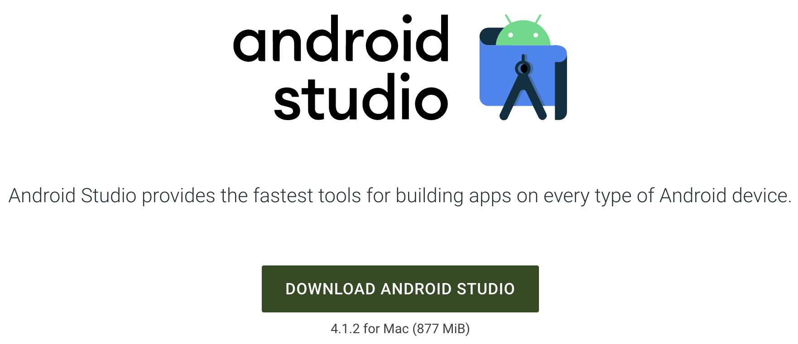
3. Прочтите его внимательно 🙃
4. Поставьте чек в "I have read and agree with the above terms and conditions", если вы согласны с лицензионным соглашением.
5. Нажмите "Download Android Studio for...".
6. Выберите, куда хотите сохранить файл установки.
7. Дождитесь окончания скачивания. Это может занять немного времени. Пока можно сделать паузу и выпить чашечку чая.

## Установка

> Если у вас возникнут проблемы с установкой, проверьте более детальное описание [тут](https://developer.android.com/studio/install.html)

Запустите установщик и следуйте показанным инструкциям. По окончанию установки студия должна показать приветственное окно.

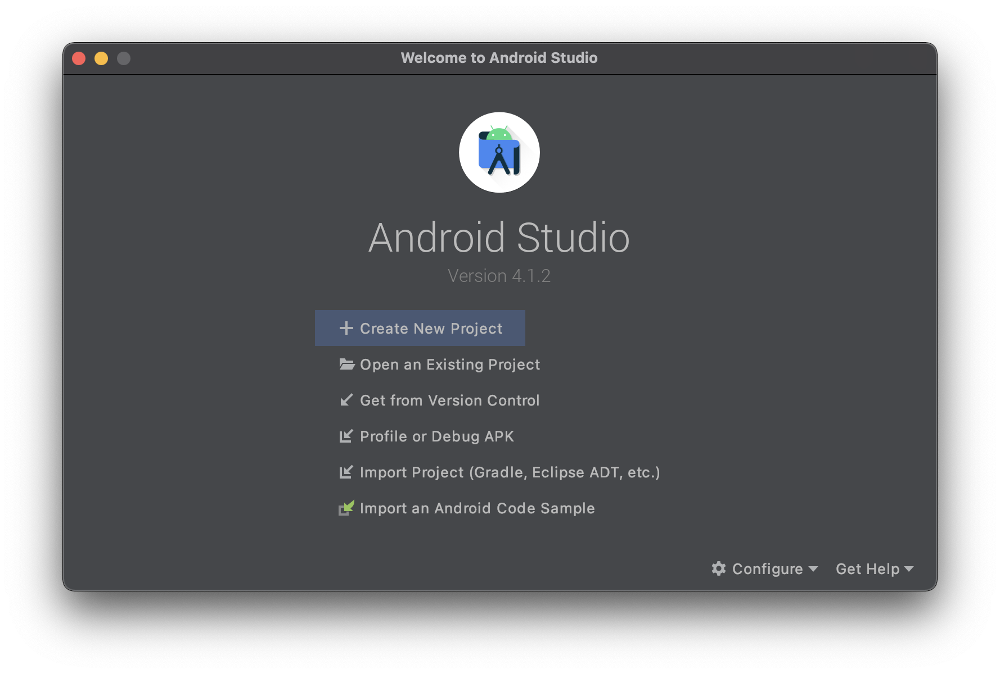

Если вы видите такое окно, то поздравляю, вы успешно установили Android Studio.

# Создание проекта

1. Нажмите Create New Project
2. Появится окно с выбором шаблона проекта. Шаблоны позволяют быстрее начать разработку. Сейчас нам нужен вариант с Empty Activity: выберите
   его и нажмите Next.
   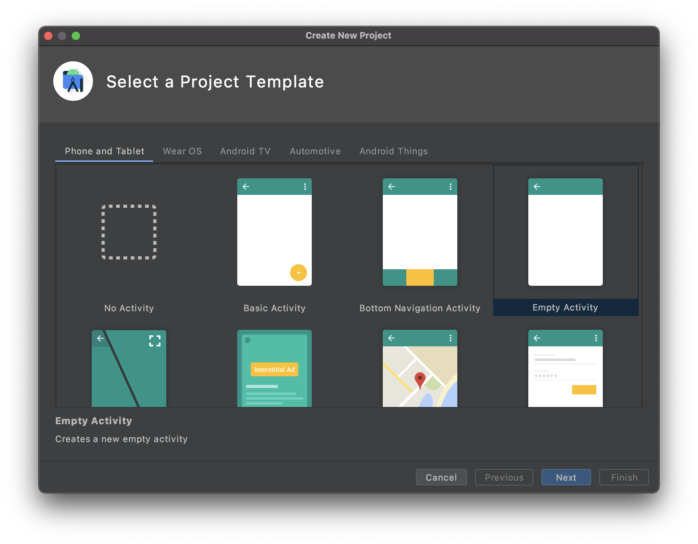
3. Откроется окно с настройками проекта:
    * __Name__ - имя вашего приложения
    * __Package name__ - уникальный идентификатор вашего приложения в системе Андроид. Обычно его составляют из адреса сайта вашей
      организации, только написанного задом наперед. Сейчас можно оставить вариант по умолчанию `com.example.myapplication`.
    * __Save location__ - расположение фалов проекта в системе.
    * __Language__ - язык, на котором будет написано приложение. Выберите Kotlin
    * __Minimum SDK__ - минимальная версия Андроид, на котором будет работать наше приложение. Можно оставить API 21. Если сомневаетесь,
      можете нажать на Help me choose, чтобы увидеть, какое количество устройств поддерживает ту или иную версию.

   Убедитесь, что чек в Use legacy android.support libraries __отсутствует__ и нажмите на кнопку Finish.
   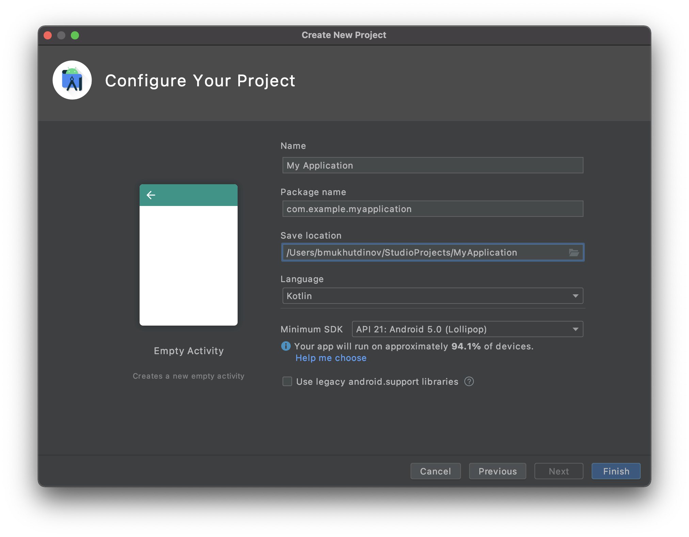

Далее мы видим основной экран редактора.
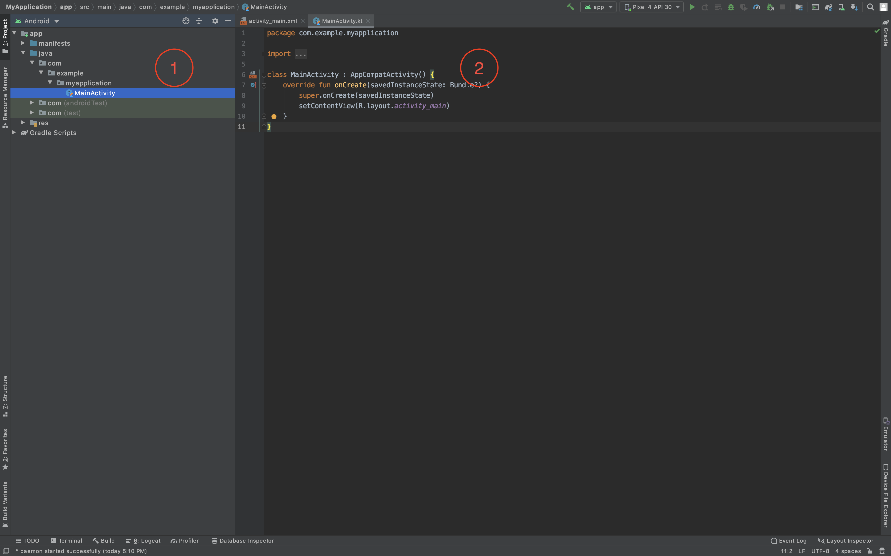

(1) В этой части указана структура проекта  
(2) Это область написания кода

Здесь мы пока ничего трогать не будем, а просто запустим приложение на __эмуляторе__. _Эмулятор_ - это программа на компьютере, которая
будет эмулировать работу мобильного устройства.

# Создание эмулятора

1. В верхнем баре выберите __Tools > AVD Manager__
   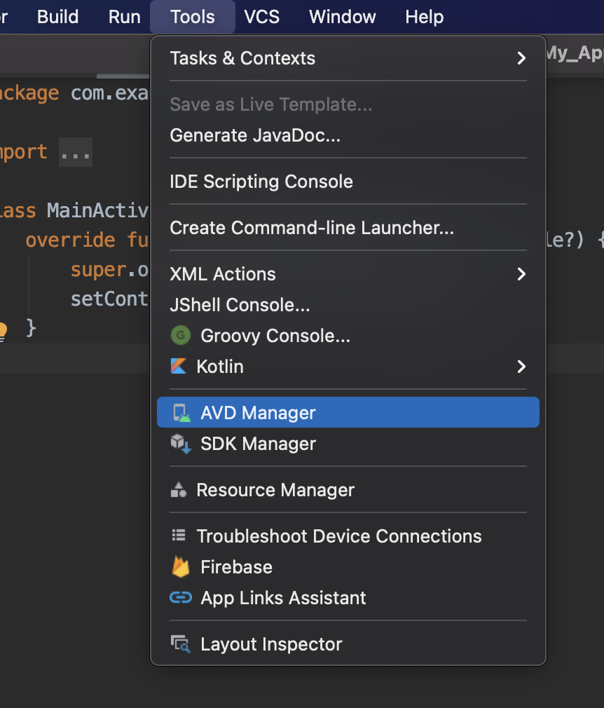
2. Откроется окно созданных эмуляторов. Т.к. мы еще не создали ни одного, оно пустое. Давайте создадим первый. Для этого нажмите на
   кнопку  __+ Create Virtual Device__
   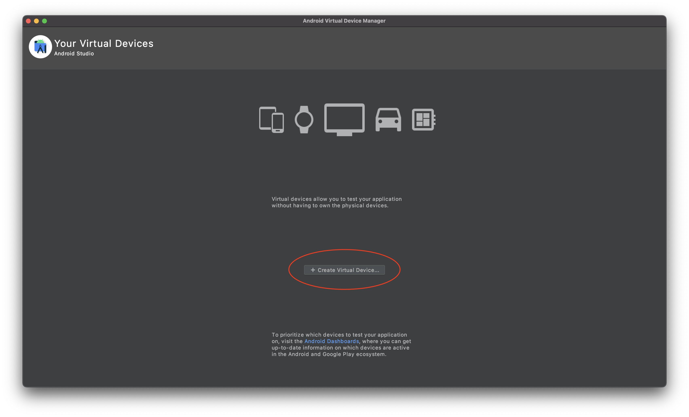
3. Мы видим, какие устройства нам доступны. Выберите то, какое вам больше нравится и нажмите __Next__. Я выберу Pixel 4 XL.
   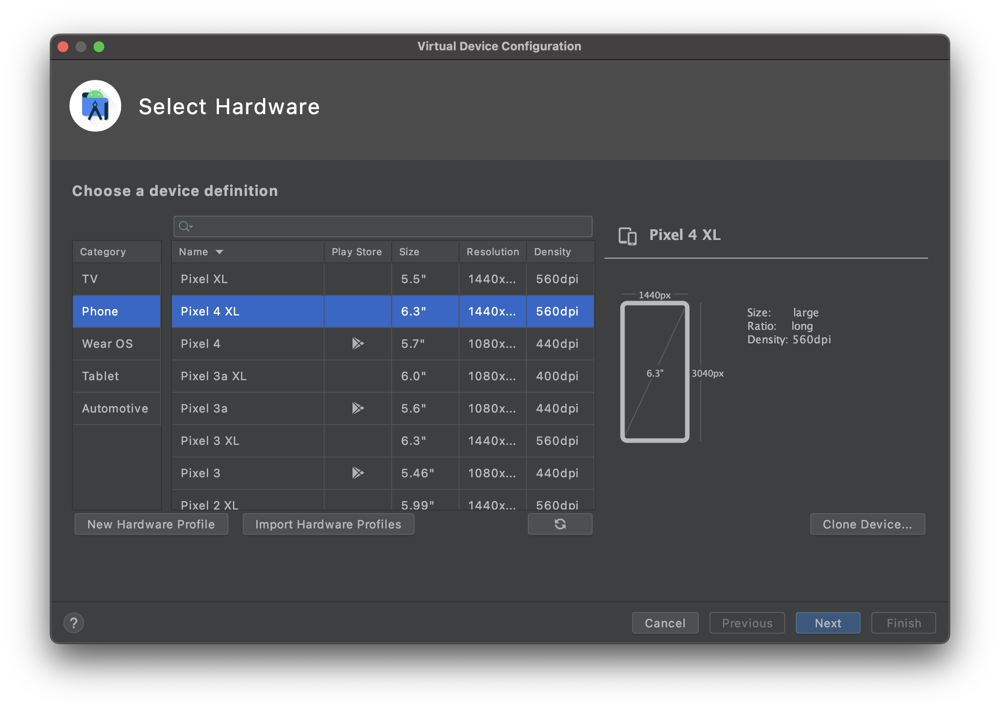
4. Далее нам надо выбрать, какую версию Андроида мы поставим на наш эмулятор. Выберите последнюю доступную версию. Если она еще не скачана,
   то нажмите __Download__. Когда все будет готово, нажимайте кнопку __Next__.
   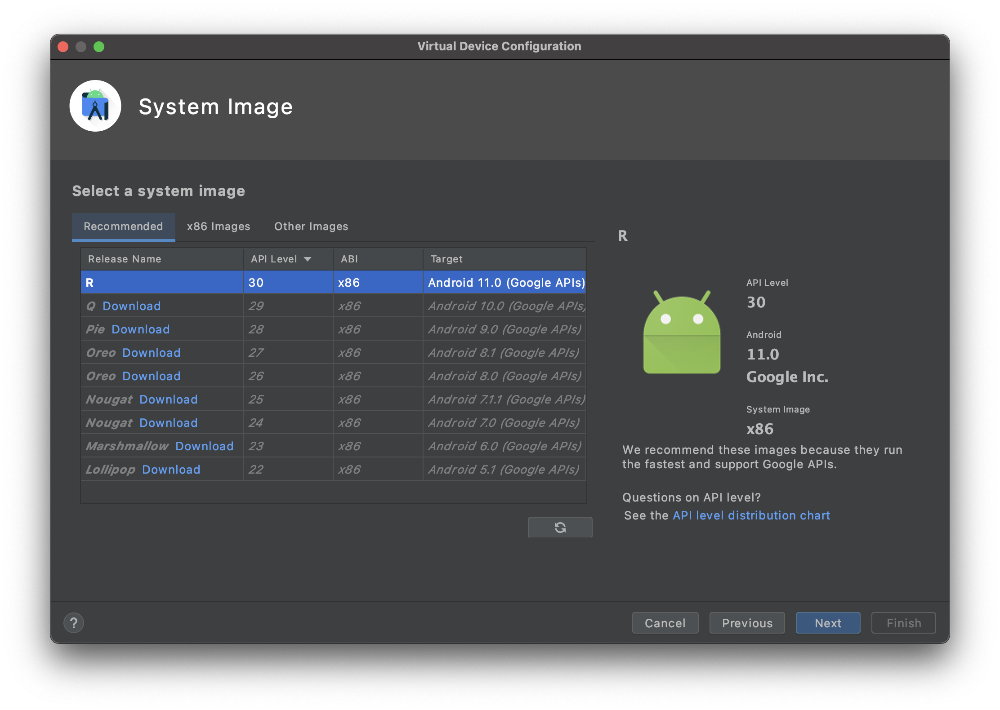
5. Последний шаг — дать имя нашему эмулятору. Вы можете выбрать любое, но для удобства я рекомендую оставить дефолтное имя. Здесь еще пара
   параметров для настройки, но их разбор находится за пределами этого урока. Если хотите, вы можете поиграться с настройками. Как только
   решите, что вы готовы, нажимайте кнопку __Finish__.
   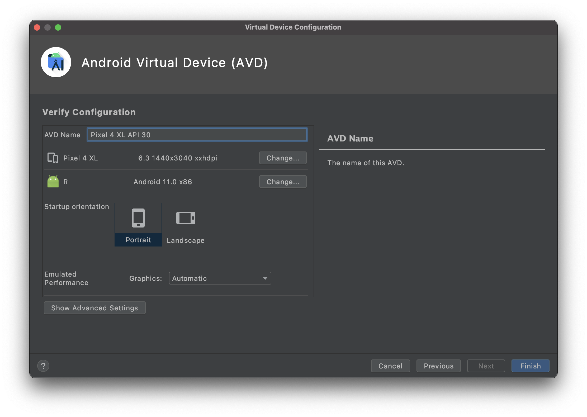

Готово, эмулятор создан. Теперь нажмите иконку "Запустить", что запустить эмулятор.
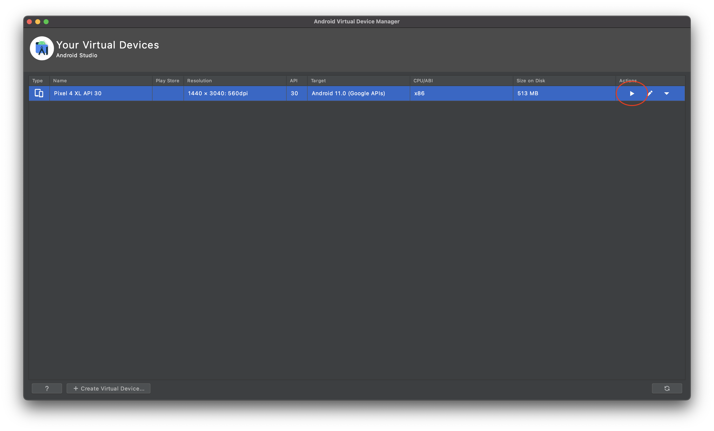

На рабочем столе должен запуститься эмулятор. Первый запуск будет долгим, остальные — гораздо быстрее. По сути, это полноценный девайс.
Теперь вы можете как захотите часто менять телефоны! Только в карман его не положишь и позвонить не получится.
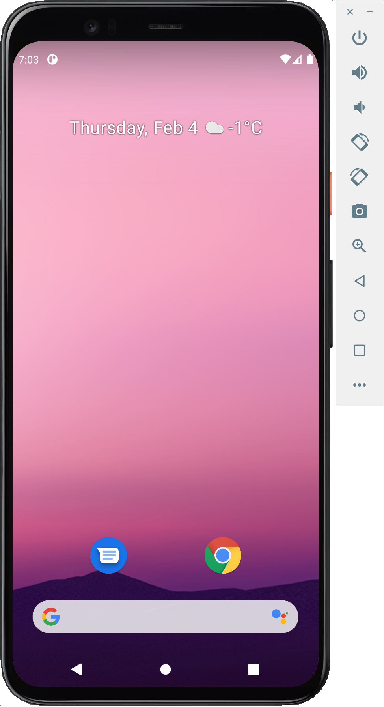

Вернитесь в студию и запустите нашу программу на созданном эмуляторе.
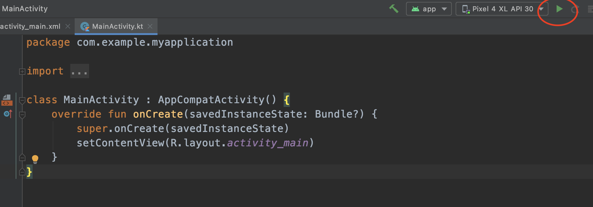

В зависимости от мощности вашего компьютера, запуск может занять некоторое время. Как только программа сбилдится, на эмуляторе вы должны
увидеть экран вашего приложения (цвета могут отличаться)
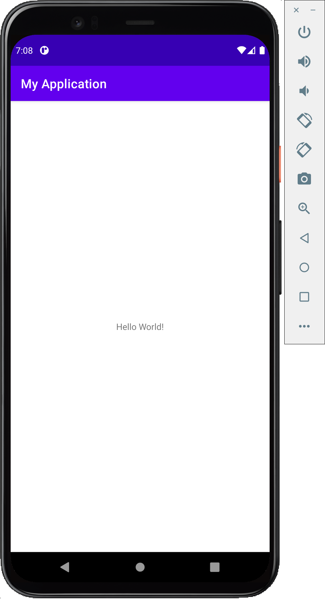

Поздравляю! Вы только что написали и запустили свое первое андроид приложение.

# Изучение структуры

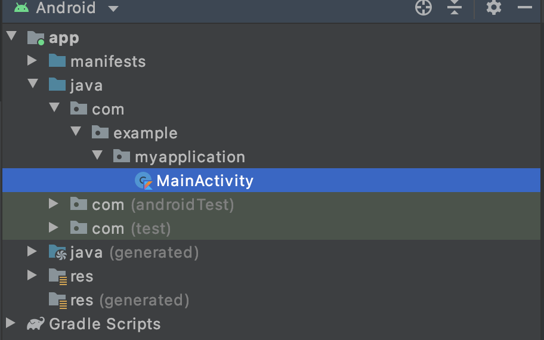

Студия создала для нас файл, который называется __MainActivity__ - в этом файле находится основной код. Откройте его двойным нажатием, если
он у вас еще не открыт.

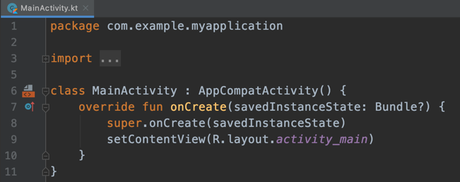
Давайте разберем, что здесь написано:

1. `package com.example.myapplication` - ключевое слово `package` обозначает, в каком пакете находится наш файл. Пакет — это просто папка.
   Если на панели структуры вы посмотрите, где находится наш файл, то увидите, что он как раз расположен в `com/example/myapplication`.
   Единственное отличие — название пакета в Котлине задается через точку `.`, а не через слеш `/`.

2. `import ...` - ключевое слово `import` говорит, какие классы из других пакетов будут использованы в нашем файле.

3. `class MainActivity : AppCompatActivity()` - здесь мы объявляем наш класс `MainActivity` и говорим, что он наследуется
   от `AppCompatActivity`. Эти концепты нам уже знакомы. В `AppCompatActivity` находится большое кол-во кода, которое позволяет управлять
   экраном приложения. Что конкретно там находится для нас сейчас большой роли не играет. Самое главное здесь понять, что для того, чтобы и
   наш класс мог управлять экраном приложения, мы должны наследоваться от `AppCompatActivity`, чтобы мы могли использовать все его поля и
   методы.

4. `override fun onCreate(savedInstanceState: Bundle?)` - в предыдущих уроках мы запускали свой код из метода `main()`. Для приложений в
   Андроиде, таким методом для нас будет `onCreate()`. Если немного забежать вперед, то у каждого экрана есть свой жизненный цикл — когда он
   открывается и закрывается. Метод `onCreate()` является первым в этом жизненном цикле. Обратите внимание, что метод принимает
   аргумент `savedInstanceState` - на текущем уровне нам не надо беспокоиться, что это такое. Мы этот аргумент использовать не будем.

5. `super.onCreate(savedInstanceState)` - ключевое слово `super` отсылает нас к родительскому классу, т.е.
   вызов `super.onCreate(savedInstanceState)` вызывает этот метод у родительского класса. Этот вызов позволяет отрисовать наш экран. Что
   именно там происходит — также не входит в рамки этого урока.

Прежде чем мы перейдем к следующей строчке кода, давайте проясним одну вещь: все вышеописанное кажется очень сложным для понимания. На
текущем нашем уровне так оно и есть. Это достаточно не тривиальные вещи, но не нужно сейчас беспокоиться об этом. Давайте будем просто
переписывать эти несколько строк кода как мантру, а уже позже разберемся, что там происходит под капотом.

6. `setContentView(R.layout.activity_main)` - единственная значащая для нас строка. Она указывает, что именно будет должно отрисоваться на
   экране, а именно `layout` с названием `activity_main`.

Чтобы понять, что все это значит, давайте откроем файл этого самого лейаута. Для этого откройте папку __res > layout__ и дважды нажмите на
файл __activity_main.xml__.

## Layout

`Лейаут` — это то, что будет расположено на экране.

Первым делом обратите внимание на эту часть экрана. Убедитесь, что выбран пункт Design.
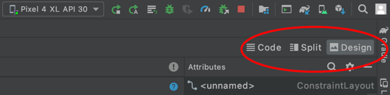

Здесь мы будем располагать наши элементы на экране. Сейчас здесь только 1 элемент — текст. В следующем уроке мы научимся добавлять элементы
и управлять ими.
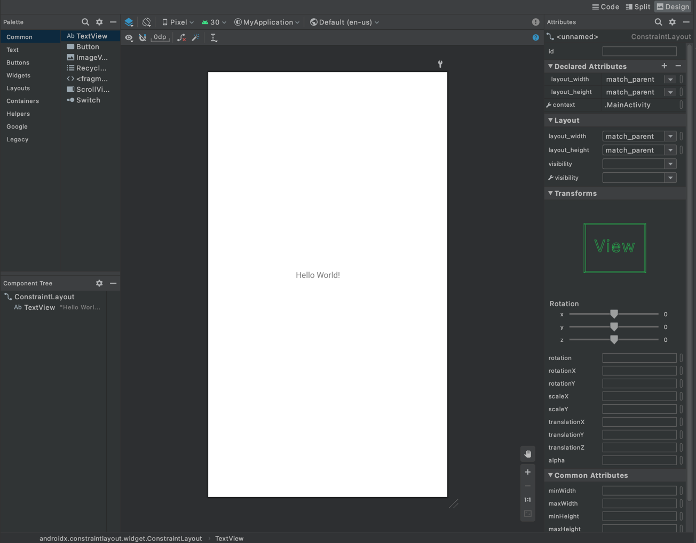

# Резюмируя

* Чтобы создать новый проект, запустите Android Studio, нажмите __+ Start a new Android Studio project__ и заполните все детали.
* Чтобы создать новый эмулятор, в верхнем меню нажмите `Tools > AVD Manager`, а затем __+ Create Virtual Device__ и заполните все детали.
* Чтобы запустить приложение на эмуляторе, сперва убедитесь, что он у вас создан, затем выберите устройство из выпадающего списка в верхнем
  меню и, наконец, нажмите иконку __Run__  все в том же меню.

# [Опционально] Запуск приложения на реальном устройстве

## Установка через USB

Чтобы включить возможность ставить приложения через студию, сначала надо включить режим разработчика на устройстве.

1. На вашем устройстве откройте __Настройки__.
2. Откройте раздел __О телефоне__
3. Нажмите на пункте __Номер сборки__ 7 раз. Введите пароль телефона, если потребуется.
4. Вернитесь в __Настройки__ и перейдите в раздел __Система__.
5. В списке должен появиться пункт __Для разработчиков__. Если вы не видите этого пункта, попробуйте развернуть весь список, нажав на __
   Дополнительно__.
6. Перейдите в раздел __Для разработчиков__ и включите переключатель для пункта __Отладка по USB__.

## Установка Google USB Driver [Только для Windows]

> Если у вас Ubuntu Linux, следуйте инструкциям на странице [Run Apps on a Hardware Device](https://developer.android.com/studio/run/device)

1. В студии нажмите __Tools > SDK Manager__.
2. Откроется окно __Settings for New Projects__
   [КАРТИНКА]
3. Нажмите на вкладку __SDK Tools__.
4. Выберите _Google USB Driver_ и нажмите __OK__.

## Запуск

1. Подсоедините свое устройство к компьютеру. На телефоне должен появиться диалог 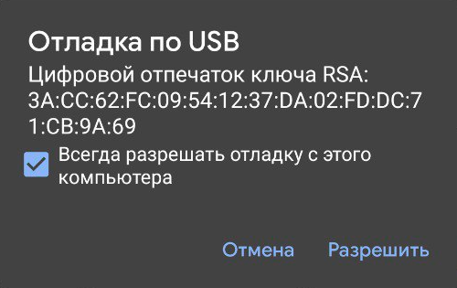
2. Выберите _Всегда разрешать отладку с этого компьютера_ и нажмите __Разрешить__
3. В студии нажмите на иконку __Run__ 

Если приложение запускается на эмуляторе, проверьте, выбрано ли ваше устройство в списке устройств

Студия установит приложение на ваше устройство и запустит его.

> Если ваше устройство работает на версии Андроид, которая еще не установлена в студии,
> вы можете увидеть сообщение о необходимости установки недостающей версии. Нажмите __Install and Continue__, затем __Finish__, чтобы завершить установку.

## Возможные проблемы

* Если ваша машина работает на Linux или Windows, вам могут потребоваться дополнительные шаги для запуска приложений на реальном устройстве.
  Для решения проблем попробуйте почитать инструкции на [Run Apps on a Hardware Device](https://developer.android.com/studio/run/device).
* На Windows вам может потребоваться установить специфичный USB драйвер для вашего устройства.
  Проверьте [OEM USB Drivers](https://developer.android.com/studio/run/oem-usb).

Если Android Studio не распознает ваше устройство, попробуйте следующее:

1. Отсоедините устройство и подсоедините снова
2. Перезапустите студию

Если ваш компьютер все равно не видит вашего устройства или определяет его как __unauthorized__, попробуйте следующее:
1. Отсоедините USB кабель
2. На устройстве откройте настройки __Для разработчиков__ 
3. Нажмите __Отозвать доступ для USB-отладки__
4. Подсоедините устройство к компьютеру
5. Заново разрешите установку с компьютера