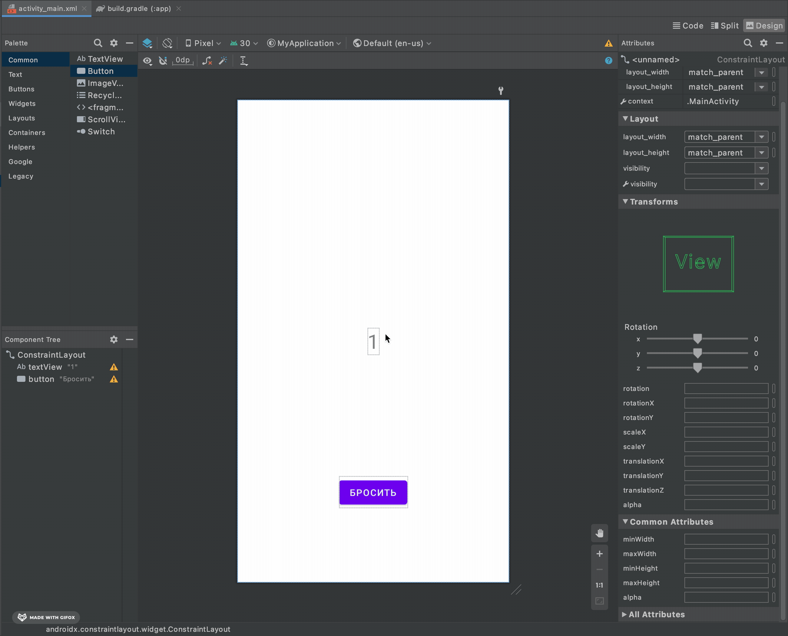

# Кости

Давайте напишем приложение, которе будет имитировать игральные кости. Сформулируем основные возможности нашего приложения:

1. Перед тем как выкинуть число, пользователь должен сделать выбор, на какое число он ставит (от 1 до 6).
2. У пользователя должна быть возможность выкинуть кости и увидеть, на каком числе они остановились.
3. Кости должны равновероятно выдавать число от 1 до 6.
4. Если пользователь правильно угадал число, то ему добавляется 10 очков.

# Бизнес логика

Будем ли мы заниматься бизнесом? Увы, но нет. Будем ли изучать логику? Тоже нет. Будем ли опять писать код? Так точно!
Бизнес логикой называют основную логику/правила приложения, как например `Кости должны равновероятно выдавать число от 1 до 6`.

Весь код мы будем писать в нашем основном классе _MainActivity_. Откроем его.

Первое, что нам нужно написать — функция, которая будет симулировать бросок игральных костей и выдавать случайное число от 1 до 6.

В Котлине есть возможность создать __диапазон__ (_range_) следующим образом

```kotlin
val r = (1..10)
```

Диапазон можно использовать, чтобы упростить запись вычисления, находится ли определённое число в заданном диапазоне. Например:

```kotlin
val myRange = (1..10)
val myInt = 5

if (myInt in myRange) {
    println("In range!")
}
```

Но на данный момент нас интересует другая возможность диапазонов — выбрать случайное (рандомное) значение из заданного диапазона.

```kotlin
val myRange = (1..10)
val random = myRange.random()
```

Напишите функцию в классе, которая будет результатом своей работы возвращать случайное число от 1 до 6.

<details>
<summary><b>Решение</b></summary>

```kotlin
class MainActivity : AppCompatActivity() {

    override fun onCreate(savedInstanceState: Bundle?) {
        super.onCreate(savedInstanceState)
        setContentView(R.layout.activity_main)
    }

    fun rollDice(): Int {
        val range = (1..6)
        return range.random()
    }
}

```

</details>

Далее нам надо подготовить функцию, которая будет определять, угадал ли число пользователь, и, если угадал, добавлять ему баллы.

Попробуйте самостоятельно написать необходимый код.

__Подсказка:__ мы должны хранить кол-во очков пользователя в поле класса, а сам метод должен принимать на вход число, выпавшее на костях и
число, которе ввел пользователь.

<details>
<summary><b>Решение</b></summary>

```kotlin
class MainActivity : AppCompatActivity() {

    var points = 0

    override fun onCreate(savedInstanceState: Bundle?) {
        super.onCreate(savedInstanceState)
        setContentView(R.layout.activity_main)
    }

    fun addPointsIfGuessed(dice: Int, guess: Int) {
        if (dice == guess) {
            points += 10
        }
    }

    fun rollDice(): Int {
        val range = (1..6)
        return range.random()
    }
}
```

> Запись `points += 10` эквивалентна `points = points + 10`. То же касается и операторов `-`, `*`, `/`

</details>

Отлично, бизнес логику мы подготовили. Теперь давайте займемся тем, что будет показано на экране.

## Layout-им

Откройте файл `activity_main.xml`. Убедитесь, что таб в левом правом углу стоит на __Design__.

1. Нам нужно отображать какое значение выпало на костях. Для этого воспользуемся текстом, который уже присутствует на экране. Поменяем текст
   на `1` (в качестве начального значения кубика).
   
2. Размер текста очень маленький. Давайте его увеличим
   
3. Теперь давайте добавим кнопку, чтобы выкидывать кубик.
   
4. Чтобы наша кнопка располагалась там, где нам нужно, ей нужно добавить ограничения (constraints)
   
5. Для того, чтобы у нас была возможность работать с UI элементами, им надо назначить id. Давайте назначим тексту id `result`, а кнопке -
   `roll`
   

Теперь посмотрим, как взаимодействовать с UI элементами. В Андроиде они называются __вью__ (_view_).

```kotlin
class MainActivity : AppCompatActivity() {

    var points = 0

    lateinit var result: TextView

    lateinit var roll: Button

    override fun onCreate(savedInstanceState: Bundle?) {
        super.onCreate(savedInstanceState)
        setContentView(R.layout.activity_main)

        result = findViewById(R.id.result)
        roll = findViewById(R.id.roll)
    }

    fun addPointsIfGuessed(dice: Int, guess: Int) {
        if (dice == guess) {
            points += 10
        }
    }

    fun rollDice(): Int {
        val range = (1..6)
        return range.random()
    }
}
``` 

* `lateinit var result` - когда мы не можем присвоить значение переменной сразу, мы можем пометить ключевым словом `lateinit`. Почему мы не
  можем сразу назначить значение нашей текстовой вью? Потому что все вьюшки создаются только после вызова
  метода `setContentView(R.layout.activity_main)`.
* `TextView` и `Button` - это классы для текстового вью и кнопки соответственно. Если строчки объявления переменных у вас подсвечиваются
  красным, проверьте, импортировались ли у вас необходимые классы. Если нет, добавьте их рядом с другими импортами.
    ```kotlin
    import android.widget.Button
    import android.widget.TextView
    ````
* `result = findViewById(R.id.result)` - здесь с помощью метода `findViewById` мы инициализируем наши вью. Этот метод принимает на вход id,
  которые мы объявили на предыдущем шаге. Обратите внимание, что этот метод должен быть вызван только после
  метода `setContentView(R.layout.activity_main)`

Теперь у нас есть переменные, которые отвечают за вью. Давайте напишем следующую логику: при нажатии на кнопку мы будем рандомить значение и
присваивать полеченное значение в наше текстовое вью.

## Обработка нажатий

Добавим обработку нажатий на кнопку. В Андроиде такие обработчики называются __лисенерами__ (_listener_).

```kotlin
roll.setOnClickListener({
    val rollResult = rollDice()
})
```

У класса `Button` есть функция, которая на вход принимает другую функцию. Каждый раз, когда кнопка будет нажата, будет вызвана наша функция.
На этом примере мы видим, что в привычные круглые скобки `( )` для передачи аргументов, мы передаем код в фигурных скобках, т.е. мы передаем
функцию.

Синтаксис Котлина позволяет опустить круглые скобки, если аргумент-функция является последним аргументом. Т.к. у нас всего один аргумент, то
он и является последним, поэтому мы можем переписать код в более простую форму:

```kotlin
roll.setOnClickListener {
    val rollResult = rollDice()
}
```

Здесь мы пишем, что при каждом нажатии на кнопку, мы будем вызывать нашу функцию `rollDice()`, чтобы получить новое значение броска кубика.
Теперь полученное значение нам надо присвоить текстовой вью.

## Меняем текст

Чтобы поменять текст у текстовой вью, напишем следующий код:

```kotlin
result.text = "$rollResult"
```

Мы обращаемся к полю `text` у нашей вью и присваиваем туда значение, полученное от `rollDice()`. Но `rollDice()` возвращает тип `Int`, а
текст должен быть типа `String`, поэтому мы оформляем полученное значение как строку.

Теперь соберем все куски вместе и посмотрим на общую картину:

```kotlin
class MainActivity : AppCompatActivity() {

    var points = 0

    lateinit var result: TextView

    lateinit var roll: Button

    override fun onCreate(savedInstanceState: Bundle?) {
        super.onCreate(savedInstanceState)
        setContentView(R.layout.activity_main)

        result = findViewById(R.id.result)
        roll = findViewById(R.id.roll)

        roll.setOnClickListener {
            val rollResult = rollDice()

            result.text = "$rollResult"
        }
    }

    fun addPointsIfGuessed(dice: Int, guess: Int) {
        if (dice == guess) {
            points += 10
        }
    }

    fun rollDice(): Int {
        val range = (1..6)
        return range.random()
    }
}
```

Запустите приложение и протестируйте его. Теперь при каждом нажатии число посередине должно меняться. Хотя, иногда следующий результат можем
быть таким же, как текущий, тогда число обновляться не будет.

## Геймификация

Теперь добавим небольшой элемент игры — пользователь должен иметь возможность сделать ставку на то, каким будет следующее значение. Вернемся
на экран UI'я. Кликните на вкладке `Buttons` и перетащите на экран 1 __RadioGroup__ и 6 __RadioButton__'ов. _RadioButton_ - это элемент,
который может быть в 2 состояниях: выбран или не выбран.


Чтобы была возможность выбрать только 1 __RadioButton__ из 6, их надо поместить в группу. Для этого нам нужно поместить __RadioButton__'ы
под __RadioGroup__.


Теперь давайте переименуем каждый __RadioButton__: от 1 до 6. И добавим соответствующие id: от `choice1` до `choice6`.


И остается добавить текстовую вью для отображения очков.


И конечно надо добавить id для этой вью.


Давайте теперь поговорим о расстановке элементов. Каждый элемент имеет зависимость слева, справа, сверху и снизу. Вью обязана иметь как
минимум 1 зависимость для верха или низа и 1 для лево или право.

Например, группа __RadioButton__'ов упирается влево на край экрана и вверх на край экрана.


А вью `points` упирается сверху на край экрана, а слева на группу __RadioButton__'ов.


Расположите все элементы, как считаете нужным. У меня получился вот такой вариант:


Запустите код и убедитесь, что все элементы располагаются как вы задумывали.

## Последний штришок

Возвращаемся в __MainActivity__. Для начала инициализируем все наши новые вью (я назначил id `geuss` в __RadioGroup__).

```kotlin
class MainActivity : AppCompatActivity() {

    var points = 0

    lateinit var result: TextView
    lateinit var pointsView: TextView
    lateinit var guess: RadioGroup

    lateinit var roll: Button

    override fun onCreate(savedInstanceState: Bundle?) {
        super.onCreate(savedInstanceState)
        setContentView(R.layout.activity_main)

        result = findViewById(R.id.result)
        roll = findViewById(R.id.roll)
        pointsView = findViewById(R.id.points)
        guess = findViewById(R.id.guess)

        roll.setOnClickListener {
            val rollResult = rollDice()

            result.text = "$rollResult"
        }
    }

    fun addPointsIfGuessed(dice: Int, guess: Int) {
        if (dice == guess) {
            points += 10
        }
    }

    fun rollDice(): Int {
        val range = (1..6)
        return range.random()
    }
}
```

Если __RadioGroup__ у вас подсвечивается красным, попробуй добавить импорт:

```kotlin
import android.widget.RadioGroup
```

Обратите внимание, что изначально у нас ни один из радио кнопок не выбран. Давай сделаем так, чтобы изначально был выбран первый пункт:

```kotlin
guess.check(R.id.choice1)
```

Мы обращаемся к _группе_ радио-кнопок и вызываем метод `check()`, чтобы выбрать _радио-кнопку_ с `id` == `R.id.choice1`. В итоге должно
получиться так:

```kotlin
override fun onCreate(savedInstanceState: Bundle?) {
    super.onCreate(savedInstanceState)
    setContentView(R.layout.activity_main)

    result = findViewById(R.id.result)
    roll = findViewById(R.id.roll)
    pointsView = findViewById(R.id.points)
    guess = findViewById(R.id.guess)

    guess.check(R.id.choice1)

    roll.setOnClickListener {
        val rollResult = rollDice()

        result.text = "$rollResult"
    }
}

```

Дальше нам надо определить какой был сделан выбор из радио-кнопок при нажатии на кнопку `Босить`:

```kotlin
roll.setOnClickListener {
    val rollResult = rollDice()

    result.text = "$rollResult"

    val checkedId = guess.checkedRadioButtonId

    var choice = 1

    if (checkedId == R.id.choice1) {
        choice = 1
    }

    if (checkedId == R.id.choice2) {
        choice = 2
    }

    if (checkedId == R.id.choice3) {
        choice = 3
    }

    if (checkedId == R.id.choice4) {
        choice = 4
    }

    if (checkedId == R.id.choice5) {
        choice = 5
    }

    if (checkedId == R.id.choice6) {
        choice = 6
    }

    addPointsIfGuessed(rollResult, choice)
}
```

* `val checkedId = guess.checkedRadioButtonId` - мы получаем `id` текущей выбранной радио-кнопки.
* `if (checkedId == R.id.choice1) { choice = 1 }` - мы проходимся по всем `id` радио-кнопок и проверяем, какой из `id` соответствует
  выбранному.
* `addPointsIfGuessed(rollResult, choice)` - в конце мы вызываем метод `addPointsIfGuessed()`, чтобы он прибавил очки, если нужно.
  Аргументами будут выпавшее на кубике число и текущий выбор пользователя.

Запись получилась довольно громоздкой. Чтобы это исправить, давайте познакомимся с ключевым словом `when`. Оно работает примерно так же, как
и `if-else`, только у `when` может быть сколько угодно много веток:

```kotlin
roll.setOnClickListener {
    val rollResult = rollDice()

    result.text = "$rollResult"

    val checkedId = guess.checkedRadioButtonId

    var choice = 1

    when (checkedId) {
        R.id.choice1 -> choice = 1
        R.id.choice2 -> choice = 2
        R.id.choice3 -> choice = 3
        R.id.choice4 -> choice = 4
        R.id.choice5 -> choice = 5
        else -> choice = 6
    }

    addPointsIfGuessed(rollResult, choice)
}
```

* `when (checkedId) { ... }` - мы пишем ключевое слово `when` и в круглые скобки пишем переменную, значение которой мы будем сравнивать.
* `R.id.choice1 -> choice = 1` - на каждой строке мы пишем сначала чему аргумент должен быть равен, а затем через стрелку `->` пишем что
  нужно в этом случае сделать.
* `else -> choice = 6` - последней строчкой может идти ключевое слово `else`, которое будет выполнено, если ни один из вариантов выше не
  отработает.

По-русски, это можно прочитать так: "Если значение `checkedId` равно `R.id.choice1`, то `choice` равен 1. Если значение `checkedId`
равно `R.id.choice2`, то `choice` равен 2 и т.д."

Нам еще нужно доработать метод `addPointsIfGuessed()`, чтобы при вызове этого метода текстовой вью текущего счета очков обновлялось.

```kotlin
fun addPointsIfGuessed(dice: Int, guess: Int) {
    if (dice == guess) {
        points += 10
    }

    pointsView.text = "Очки: $points"
}
```

Финальная версия кода (внимание, большие объемы):

```kotlin
class MainActivity : AppCompatActivity() {

    var points = 0

    lateinit var result: TextView
    lateinit var pointsView: TextView
    lateinit var guess: RadioGroup

    lateinit var roll: Button

    override fun onCreate(savedInstanceState: Bundle?) {
        super.onCreate(savedInstanceState)
        setContentView(R.layout.activity_main)

        result = findViewById(R.id.result)
        roll = findViewById(R.id.roll)
        pointsView = findViewById(R.id.points)
        guess = findViewById(R.id.guess)

        guess.check(R.id.choice1)

        roll.setOnClickListener {
            val rollResult = rollDice()

            result.text = "$rollResult"

            val checkedId = guess.checkedRadioButtonId

            var choice = 1

            when (checkedId) {
                R.id.choice1 -> choice = 1
                R.id.choice2 -> choice = 2
                R.id.choice3 -> choice = 3
                R.id.choice4 -> choice = 4
                R.id.choice5 -> choice = 5
                else -> choice = 6
            }

            addPointsIfGuessed(rollResult, choice)
        }
    }

    fun addPointsIfGuessed(dice: Int, guess: Int) {
        if (dice == guess) {
            points += 10
        }

        pointsView.text = "Очки: $points"
    }

    fun rollDice(): Int {
        val range = (1..6)
        return range.random()
    }
}
```

Запустите код и поиграйте в приложение, которое сами же создали:


# Резюмируя

* Чтобы получить случайное число из заданного промежутка, используйте `(1..10).random()`
* Элементы на экране называются __вью__ (_view_) и создаются в файле `activity_main.xml`
* Необходимо задавать `id` у вью, чтобы потом обращаться к ним в коде
* Весь код пишется в классе __MainActivity__ в методе `onCreate()`

# Финал

Используя только необходимый минимум в программировании, мы написали приложение на Андроиде. Надеюсь, этот короткий курс сумел зародить у
вас интерес к разработке приложений. Если вам понравился курс, то вы можете оставить свою [почту](https://forms.gle/ySPLAbnNrJYi9Bsf9),
чтобы получить оповещение, когда выйдут новые курсы.

Я хочу, чтобы отличительной чертой этих курсов была направленность на необходимый минимум знаний, чтобы как можно раньше начать полноценно
работать в IT-индустрии. И самое главное — чтобы проходить эти курсы было не скучно. Чтобы не приходилось пересиливать себя для еще одного
урока.

В больших компаниях поставленность производства курсов на поток делает невозможным соблюдать должный контроль качества каждого курса. Здесь
же я постараюсь обратить внимание на каждую деталь, чтобы соблюсти баланс интереса к курсу и объема знаний.

# Отзывы и предложения

Если вам есть что сказать автору касательно данного курса, пожалуйста, напишите мне на почту __ji.brew.team@gmail.com__ или
заполните [форму](https://forms.gle/Gyzhe6JYphfMAtSq7). Для обсуждения вопросов присоединяйтесь к нашему
телеграм [чату](https://t.me/JiBrewAndroid).
